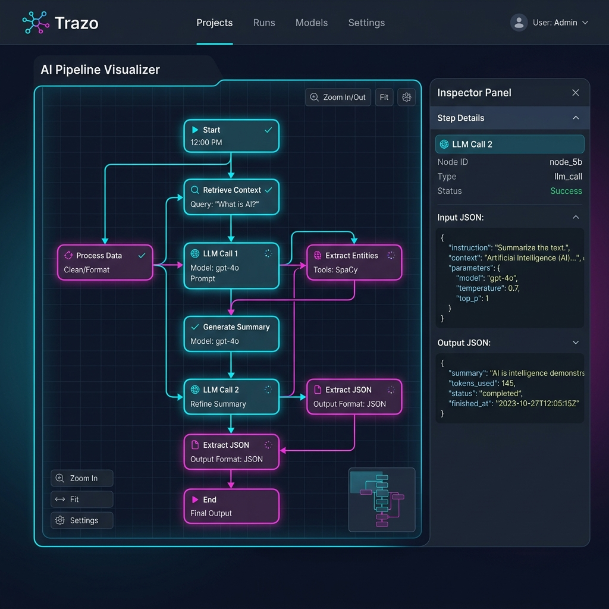
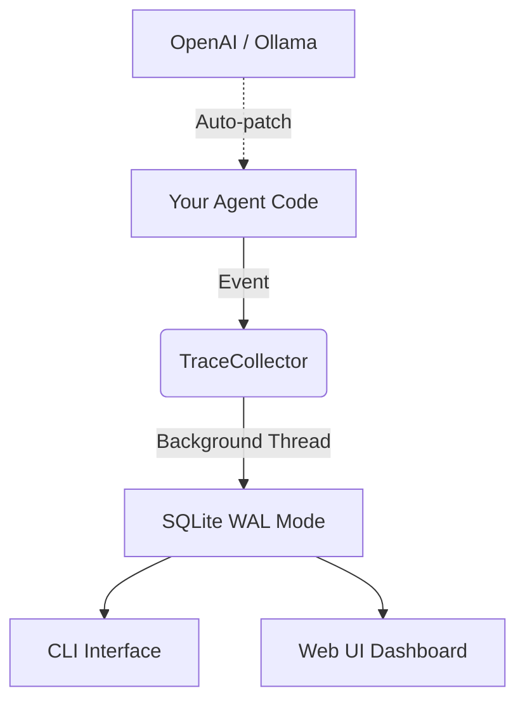

# 🧵 Trazo

**Universal Execution Tracer & Semantic Diff Engine for LLM Agent Pipelines.**

[](https://github.com/Vikhram-S/trazo-dev/actions/workflows/ci.yml)
[](https://badge.fury.io/py/trazo)
[](https://pypi.org/project/trazo/)
[](https://opensource.org/licenses/MIT)
[](https://pepy.tech/project/trazo)
[](https://pypi.org/project/trazo/)
[](https://github.com/Vikhram-S/trazo-dev/stargazers)
[](https://discord.gg/4dYs3a3KmK)

*Know exactly why your agent did what it did — and how it changed.*

[Quickstart](#-quickstart) • [Key Features](#-key-features) • [CLI Reference](#-cli-reference) • [Architecture](#-architecture) • [Contributing](#-contributing)

</div>

---

## 🧐 What is Trazo?

Building LLM agents is easy. Debugging them is hard. When your pipeline behavior shifts, Trazo tells you **why**. 

Trazo is a local-first, zero-dependency tracing library that captures every step of your agent's execution, tracks costs, and allows you to semantically diff two runs to see exactly what changed in your prompts, models, or outputs.

### Before Trazo:
- `print(response)` spam in your terminal.
- Grepping through 100MB log files.
- Re-running expensive pipelines just to see a single intermediate output.
- Paying $$$ for cloud observability tools just to debug a local script.

### After Trazo:
- 🔍 **Visual DAGs**: See your pipeline execution as a beautiful tree.
- 🔀 **Semantic Diffs**: Instant comparison of two runs with similarity scores.
- ⏮️ **Time-Travel Replay**: Re-run any specific step with original inputs.
- 💰 **Cost Tracking**: Automated token counting and USD cost estimation.
- 🔒 **100% Local**: No data ever leaves your machine. SQLite powered.

---

## 🚀 Quickstart

### 1. Install
```bash
pip install "trazo[ui]"
```

### 2. Instrument in 3 Lines
```python
import trazo as tz

tz.init()  # Initialize storage
tz.instrument_ollama()  # Auto-instrument local models

@tz.trace  # Trace any function
def my_agent_step(query: str):
    # Your logic here...
    return "Result"

with tz.run("my_first_trace"):
    my_agent_step("How does transformers work?")
```

### 3. See the Magic
```bash
trazo view       # List recent runs
trazo ui         # Launch the visual DAG viewer at http://localhost:7432
```



---

## ✨ Key Features

### 🔍 Automatic Instrumentation
Just call `tz.instrument_openai()` or `tz.instrument_ollama()` at the top of your script. Trazo handles the rest—capturing inputs, outputs, tokens, and latency without touching your code.

### 🔀 Semantic Diff Engine
Compare two versions of your pipeline. Trazo matches spans by name and calculates a similarity score using lightweight n-gram hashing (no ML needed) or real embeddings (optional).

```bash
trazo diff [baseline_id] [current_id]
```

### ⏮️ Time-Travel Debugging
Spotted a failure in a complex chain? Use `trazo replay [span_id]` to re-execute just that specific step with the exact same inputs, or override them to test a fix.

### 📊 Rich Terminal UI
No browser? No problem. Trazo provides a high-fidelity terminal interface using `rich` for inspecting traces, diffs, and logs directly in your shell.

---

## 🛠️ CLI Reference

| Command | Description |
|---------|-------------|
| `trazo view` | List runs or inspect a specific run/span tree |
| `trazo diff` | Compare two runs and highlight semantic changes |
| `trazo replay` | Re-run a span with original or modified inputs |
| `trazo ui` | Start the local web dashboard (FastAPI + D3.js) |
| `trazo clean` | Prune old traces to save disk space |
| `trazo export` | Export traces to JSON or interactive HTML |

---

## 🏗️ Architecture

Trazo is designed to be **non-blocking** and **local-first**.



- **Storage**: SQLite with WAL mode for high concurrency.
- **Context**: `contextvars` ensures correct parent-child linking even in complex async/await flows.
- **Performance**: The background flush worker ensures tracing overhead is negligible (< 1ms).

---

## 🏆 Why Trazo?

| Feature | Trazo | LangSmith | Weights & Biases |
|---------|-------|-----------|------------------|
| **Local-first** | ✅ Yes | ❌ No | ❌ No |
| **Zero Setup** | ✅ Yes | ❌ No | ❌ No |
| **Semantic Diff** | ✅ Built-in | ❌ Basic | ❌ No |
| **Cost** | 🆓 Free | 💰 Paid | 💰 Paid |
| **Privacy** | 🔒 100% | ☁️ Cloud | ☁️ Cloud |

---

## 🤝 Contributing

We love contributors! Whether it's fixing a bug, adding a new integration (Anthropic, Gemini, etc.), or improving the UI.

1. Fork the repo.
2. `pip install -e ".[dev,ui]"`
3. Create your feature branch.
4. Open a Pull Request.

Check out our [Contributing Guide](CONTRIBUTING.md) for more details.

---

## 🗺️ Roadmap

- [x] Core Tracing & SQLite Storage
- [x] Semantic Diff CLI
- [x] Interactive DAG Viewer
- [x] OpenAI & Ollama Integrations
- [ ] **Anthropic & Google Gemini Integration** (Coming Soon)
- [ ] **GitHub Actions Integration**: Fail PRs if semantic similarity drops!
- [ ] **MCP Server Support**: Chat with your traces in Claude Desktop.

---

<div align="center">

**[⭐ Star us on GitHub](https://github.com/Vikhram-S/trazo-dev)** · **[💬 Join the Discord](https://discord.gg/4dYs3a3KmK)**

MIT License © 2026 Vikhram S

</div>
